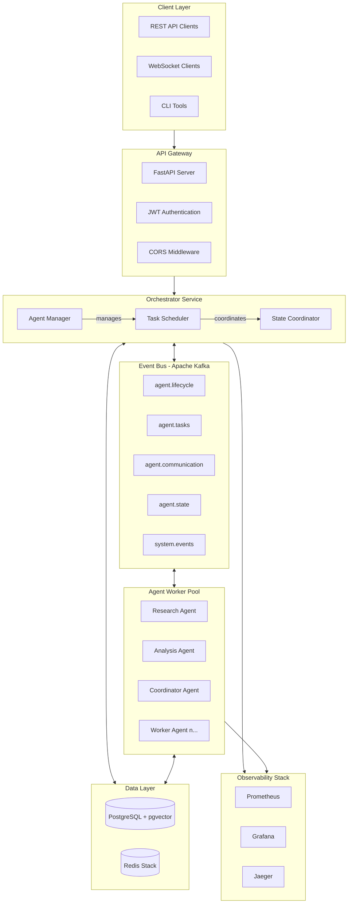
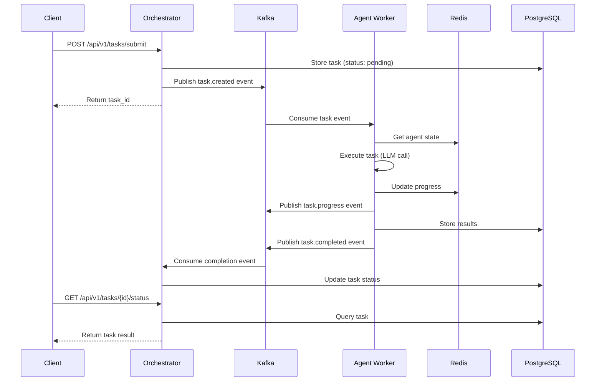
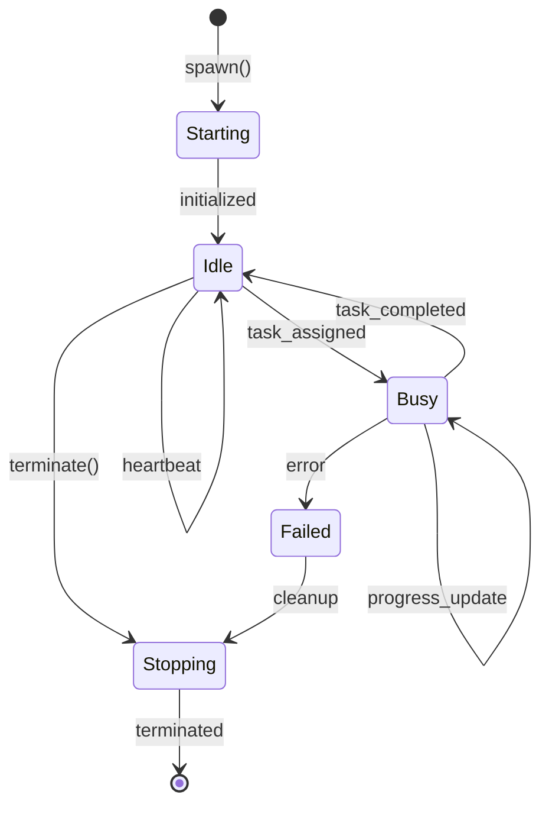
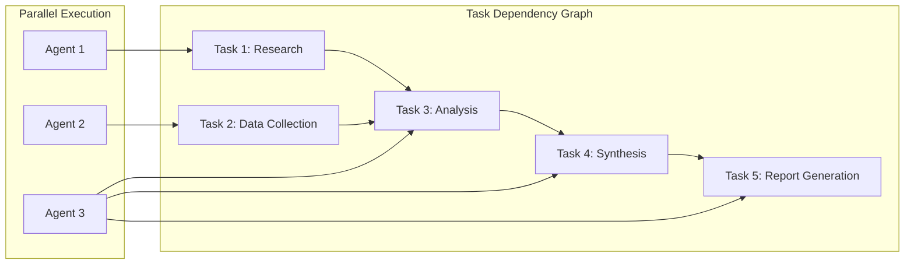
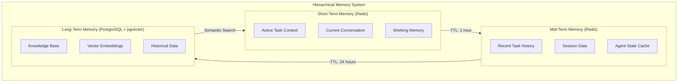
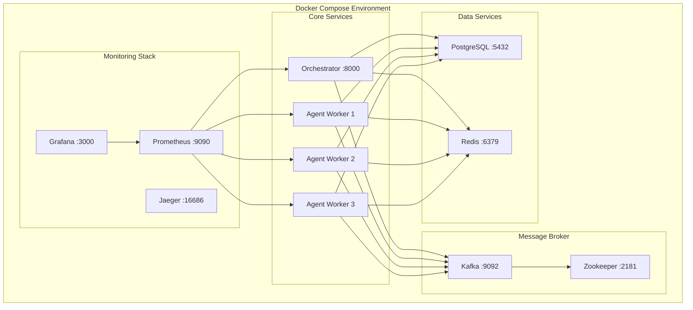
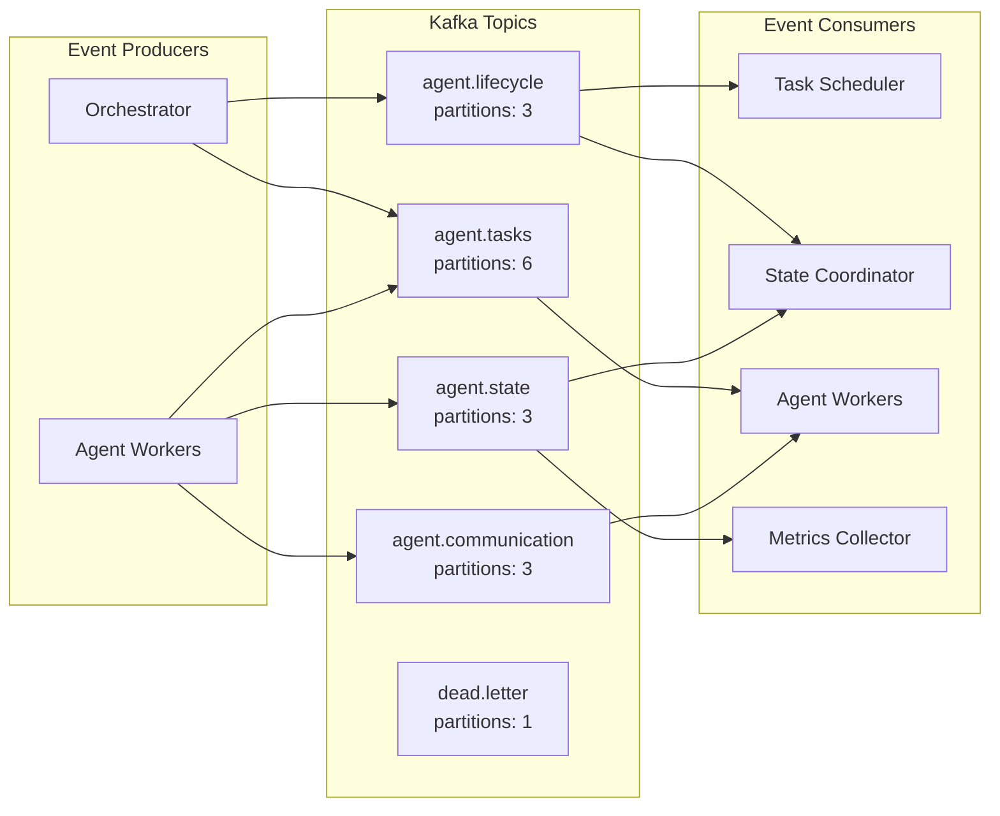

# Distributed Multi-Agent Orchestration Platform

[](.)
[](LICENSE)

A production-ready distributed multi-agent orchestration platform that coordinates AI agents across distributed environments with offline capability, intelligent synchronization, and enterprise-grade reliability.

**Total Lines of Code: 23,000+** (Python, TypeScript, React)

## Overview

This platform provides:
- **Agent Lifecycle Management**: Spawn, monitor, and terminate AI agents dynamically
- **Task Orchestration**: DAG-based task dependencies, priority queuing, and parallel execution
- **Event-Driven Communication**: Kafka-based event streaming for inter-agent messaging
- **State Management**: Hierarchical memory with Redis (hot state) and PostgreSQL (persistent)
- **Vector Search**: Semantic memory search using pgvector
- **Observability**: Distributed tracing, metrics, and structured logging
- **Advanced Analytics**: Time-series metrics, performance scoring, and AI-powered insights
- **Audit Trail**: Comprehensive event logging for compliance and debugging
- **Webhook System**: Reliable event delivery with retries and HMAC signatures
- **React Dashboard**: Production-grade UI with real-time updates
- **Landing Page**: Premium Next.js marketing site with authentication

## Architecture Diagrams

### High-Level System Architecture



### Component Interaction Flow



### Agent Lifecycle State Machine



### Task Execution DAG



### Memory Hierarchy



### Infrastructure Components



### Event-Driven Architecture



## Technology Stack

| Component | Technology |
|-----------|------------|
| Backend | Python 3.11+, FastAPI |
| Frontend | React 18, TypeScript, Vite |
| Landing Page | Next.js 14, Tailwind CSS, Framer Motion |
| Message Broker | Apache Kafka |
| Primary Database | PostgreSQL 16 + pgvector |
| Cache/State | Redis 7.4+ |
| LLM Integration | Anthropic Claude, OpenAI |
| Agent Framework | LangChain + LangGraph |
| Tracing | OpenTelemetry + Jaeger |
| Metrics | Prometheus + Grafana |
| Containerization | Docker + Kubernetes |

## Quick Start

### Prerequisites

- Docker and Docker Compose
- Python 3.11+
- Anthropic API key (for Claude)
- OpenAI API key (optional, for embeddings)

### Local Development

1. **Clone the repository**
   ```bash
   git clone https://github.com/yourusername/DistributedMultiAgentOrchestration.git
   cd DistributedMultiAgentOrchestration
   ```

2. **Set up environment variables**
   ```bash
   # Create .env file with your API keys
   cat > .env << EOF
   ANTHROPIC_API_KEY=your_anthropic_key_here
   OPENAI_API_KEY=your_openai_key_here
   EOF
   ```

3. **Start all services**
   ```bash
   docker-compose up -d
   ```

4. **Verify services are running**
   ```bash
   docker-compose ps
   ```

5. **Check health status**
   ```bash
   curl http://localhost:8000/api/v1/health
   ```

### Service Endpoints

| Service | URL | Description |
|---------|-----|-------------|
| Orchestrator API | http://localhost:8000 | Main API endpoint |
| API Documentation | http://localhost:8000/docs | Swagger UI |
| Prometheus | http://localhost:9090 | Metrics |
| Grafana | http://localhost:3000 | Dashboards (admin/admin) |
| Jaeger UI | http://localhost:16686 | Distributed tracing |
| Redis Insight | http://localhost:8001 | Redis management |

### API Examples

**Spawn an Agent**
```bash
curl -X POST http://localhost:8000/api/v1/agents/spawn \
  -H "Content-Type: application/json" \
  -d '{
    "agent_type": "research",
    "name": "research-agent-1",
    "capabilities": ["web_search", "document_analysis"]
  }'
```

**Submit a Task**
```bash
curl -X POST http://localhost:8000/api/v1/tasks/submit \
  -H "Content-Type: application/json" \
  -d '{
    "description": "Research the latest developments in multi-agent AI systems",
    "priority": 1,
    "agent_type": "research"
  }'
```

**Get Task Status**
```bash
curl http://localhost:8000/api/v1/tasks/{task_id}/status
```

## Project Structure

```
DistributedMultiAgentOrchestration/
├── services/
│   ├── orchestrator/           # Central coordinator service
│   │   ├── api/                # REST API routes
│   │   ├── core/               # Core business logic
│   │   │   ├── agent_manager.py
│   │   │   ├── task_scheduler.py
│   │   │   └── state_coordinator.py
│   │   ├── config.py           # Service configuration
│   │   └── main.py             # FastAPI application
│   └── agent-worker/           # Distributed worker service
│       ├── agents/             # Agent implementations
│       │   ├── base_agent.py
│       │   ├── research_agent.py
│       │   └── analysis_agent.py
│       ├── execution/          # Task execution engine
│       │   ├── task_executor.py
│       │   └── memory_manager.py
│       └── main.py             # Worker entry point
├── shared/                     # Shared libraries
│   ├── database/               # Database connections & models
│   ├── events/                 # Kafka producers/consumers
│   ├── models/                 # Pydantic schemas
│   └── observability/          # Tracing, metrics, logging
├── infrastructure/             # Infrastructure configs
│   ├── postgres/               # Database init scripts
│   ├── prometheus/             # Prometheus config
│   └── grafana/                # Grafana dashboards
├── kubernetes/                 # K8s deployment manifests
├── tests/                      # Test suites
│   ├── unit/
│   └── integration/
├── docker-compose.yml          # Local development
└── README.md
```

## Configuration

### Environment Variables

| Variable | Description | Default |
|----------|-------------|---------|
| `DATABASE_URL` | PostgreSQL connection URL | `postgresql+asyncpg://...` |
| `REDIS_URL` | Redis connection URL | `redis://localhost:6379` |
| `KAFKA_BOOTSTRAP_SERVERS` | Kafka brokers | `localhost:9092` |
| `ANTHROPIC_API_KEY` | Anthropic API key | Required |
| `OPENAI_API_KEY` | OpenAI API key | Optional |
| `LOG_LEVEL` | Logging level | `INFO` |
| `JAEGER_AGENT_HOST` | Jaeger host | `localhost` |
| `JAEGER_AGENT_PORT` | Jaeger port | `6831` |

## Agent Types

### Research Agent
- Web search and document analysis
- Information synthesis and summarization
- Source citation and verification

### Analysis Agent
- Data processing and pattern recognition
- Statistical analysis
- Insight generation and recommendations

### Coordinator Agent
- Sub-task delegation
- Result aggregation
- Workflow orchestration

## Memory Management

The platform implements a hierarchical memory system:

| Tier | Storage | TTL | Use Case |
|------|---------|-----|----------|
| Short-term | Redis | 1 hour | Active task context, working memory |
| Mid-term | Redis | 24 hours | Recent history, session data |
| Long-term | PostgreSQL + pgvector | Permanent | Knowledge base, semantic search |

## Observability

### Metrics (Prometheus)
- Agent utilization and health
- Task completion rates and duration
- Message queue depths
- LLM API latency and errors

### Tracing (Jaeger)
- Distributed request tracing
- Cross-service correlation
- Latency analysis

### Logging (Structured JSON)
- Request/response logging
- Error tracking
- Audit trail

## Production Deployment

### Kubernetes

```bash
# Create namespace
kubectl apply -f kubernetes/namespace.yaml

# Deploy secrets and configmaps
kubectl apply -f kubernetes/secrets.yaml
kubectl apply -f kubernetes/configmap.yaml

# Deploy infrastructure
kubectl apply -f kubernetes/postgres-statefulset.yaml
kubectl apply -f kubernetes/redis-deployment.yaml
kubectl apply -f kubernetes/kafka-statefulset.yaml

# Deploy services
kubectl apply -f kubernetes/orchestrator-deployment.yaml
kubectl apply -f kubernetes/agent-worker-deployment.yaml

# Deploy ingress
kubectl apply -f kubernetes/ingress.yaml
```

### Scaling

The platform supports horizontal scaling:
- **Orchestrator**: 2-10 replicas (HPA based on CPU/memory)
- **Agent Workers**: 3-50 replicas (HPA based on queue depth)

## Testing

```bash
# Unit tests
pytest tests/unit -v

# Integration tests
pytest tests/integration -v

# With coverage
pytest --cov=services --cov=shared tests/
```

## API Reference

See the interactive API documentation at `/docs` when the orchestrator is running.

### Key Endpoints

| Method | Endpoint | Description |
|--------|----------|-------------|
| POST | `/api/v1/agents/spawn` | Spawn a new agent |
| GET | `/api/v1/agents` | List all agents |
| GET | `/api/v1/agents/{id}` | Get agent details |
| DELETE | `/api/v1/agents/{id}` | Terminate agent |
| POST | `/api/v1/tasks/submit` | Submit a new task |
| GET | `/api/v1/tasks/{id}` | Get task details |
| GET | `/api/v1/tasks/{id}/status` | Get task status |
| GET | `/api/v1/health` | Health check |
| GET | `/metrics` | Prometheus metrics |

## Contributing

1. Fork the repository
2. Create a feature branch
3. Make your changes
4. Run tests
5. Submit a pull request

## License

MIT License - see LICENSE file for details.
